# Benchmark CSV → Parquet 2025

Un notebook interactif pour comparer les performances de **Pandas**, **Polars**, **PySpark** et **DuckDB** sur :
- **Conversion** CSV → Parquet (avec monitoring CPU/RAM)
- **Requêtage** CSV vs Parquet (predicate pushdown)
- **Écriture** massive (10 millions de lignes)

## Quick Start

```bash
# 1. Cloner et installer
git clone https://github.com/votre-username/benchmark-csv-parquet.git
cd benchmark-csv-parquet
pip install -r requirements.txt

# 2. Ajouter vos CSV dans data/
cp /chemin/vers/votre/fichier.csv data/

# 3. Lancer le notebook
jupyter notebook benchmark.ipynb
```

## Configuration

Copiez `.env.example` en `.env` et ajustez selon vos besoins :

```bash
cp .env.example .env
```

```ini
# Activer/désactiver des librairies
BENCH_PANDAS=true
BENCH_POLARS=true
BENCH_DUCKDB=true
BENCH_PYSPARK=true

# Configuration Spark
SPARK_DRIVER_MEMORY=8g
SPARK_EXECUTOR_MEMORY=8g
SPARK_MASTER=local[*]

# Timing
SAMPLE_INTERVAL=0.5
COOLDOWN_TIME=5
```

## Principe

```mermaid
graph TD
    subgraph "Pourquoi ces écarts ?"
        A[Pandas] -->|Single-thread| A1[~8% CPU]
        A -->|Copies mémoire| A2[RAM x8-10]
        
        B[Polars] -->|Multi-thread Rust| B1[~75% CPU]
        B -->|Zero-copy Arrow| B2[RAM x2-3]
        
        C[PySpark] -->|JVM startup| C1[+2-3s latence]
        C -->|Distribué| C2[Overkill local]
        
        D[DuckDB] -->|SQL analytique| D1[Simple]
        D -->|In-process| D2[Pas d'infra]
    end
```




## Résultats

Sur un fichier SIRENE de **3.8 Go** (AMD Ryzen 12 threads / 64 GB RAM) :

### Conversion CSV → Parquet

| Bibliothèque | Durée | CPU avg | RAM max | Ratio |
|--------------|-------|---------|---------|-------|
| **Polars**   | **9.1s** | 65.9% | 8.0 GB | 1x |
| PySpark      | 29.4s | 95.0% | 5.7 GB | 3.2x |
| DuckDB       | 52.3s | 23.5% | 14.9 GB | 5.7x |
| Pandas       | 224.9s | 8.8% | **49.7 GB** | **24.6x** |

### Requêtage (SELECT WHERE siren=X)

| Méthode | Durée | Ratio |
|---------|-------|-------|
| Polars Lazy Parquet | **0.028s** | 1x |
| DuckDB Parquet | 0.086s | 3x |
| PySpark Parquet | 0.22s | 8x |
| Pandas CSV | 163.9s | **5930x** |

### Écriture (10 millions de lignes)

| Méthode | Durée | Ratio |
|---------|-------|-------|
| Polars Parquet | **2.0s** | 1x |
| PySpark Parquet | 9.2s | 4.6x |
| Pandas CSV | 53.2s | **26.7x** |

**Polars est 25x plus rapide que Pandas** pour la conversion et consomme **6x moins de RAM**.

## Structure du projet

```
.
├── benchmark.ipynb         # Notebook principal (conversion + requêtes + visualisation)
├── benchmark_lib.py        # Module de fonctions utilitaires
├── requirements.txt        # Dépendances
├── .env.example            # Configuration exemple
├── .env                    # Votre configuration (gitignored)
├── LICENSE                 # Licence MIT
├── data/                   # Vos fichiers CSV (gitignored)
├── benchmark_outputs/      # Parquet générés (gitignored)
└── benchmark_metrics/      # Métriques JSON (gitignored)
```

## Métriques collectées

Pour chaque librairie :
- **Durée** totale d'exécution
- **CPU** moyenne et pic (normalisé par nombre de threads)
- **RAM** moyenne et pic
- **Timeseries** CPU/RAM (configurable)

Pour PySpark :
- Temps de démarrage session Spark
- Temps d'écriture réel (hors init JVM)

## Usage avancé

### Benchmark partiel

Dans `.env` :
```ini
BENCH_PANDAS=false   # Désactiver Pandas
BENCH_PYSPARK=false  # Désactiver PySpark
```

### Configuration Spark pour gros fichiers

```ini
SPARK_DRIVER_MEMORY=16g
SPARK_EXECUTOR_MEMORY=16g
SPARK_SHUFFLE_PARTITIONS=24
SPARK_PARALLELISM=24
```

## Prérequis

- **Python 3.9+**
- **Java 8+** (pour PySpark uniquement)
- **16 GB RAM** minimum recommandé

## Cas d'usage

- **ETL local** : Bronze → Silver (architecture médaillon)
- **Data Engineering** : choix de stack
- **FinOps** : optimisation coûts cloud (25x moins de compute = 25x moins cher)

## Migration Pandas → Polars

```python
# Pandas
df = pd.read_csv("data.csv")
df.to_parquet("output.parquet")

# Polars (lazy mode - avec predicate pushdown)
pl.scan_csv("data.csv").sink_parquet("output.parquet")

# Polars - Requête optimisée (6000x plus rapide que Pandas CSV)
result = pl.scan_parquet("data.parquet").filter(pl.col("siren") == 123456789).collect()
```

## Article associé

📖 [Benchmark de librairies 2025 : Pourquoi j'ai lâché Pandas pour Polars](https://liiink-it.com/blog/benchmark-libs-2025)

## Licence

MIT - Voir [LICENSE](LICENSE)

## Auteur

Ruben Torney - [Liiink](https://liiink-it.com/)
